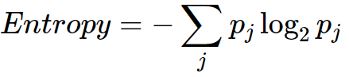

# Predicting The Likelihood Of E-Signing A Loan Based On Financial History.

Lending companies work by analysing the financial history of their loan applicants, and choosing whether or not the applicant is too risky to be given a loan. If the applicant is not, the company then determines the terms of the loan. To acquire these applicants, companies can organically receive them through their websites/apps, often with the help of advertisement campaigns. Other times lending companies partner with peer-to-peer (P2P) lending marketplaces, in order to acquire leeds of possible applicants. Some example marketplaces include Upstart, Lending Tree, and Lending Club. In this project, we are going to assess the quality of the leads our company receives from these types of marketplaces.

- **Market:** The target audience are the loan applicants who reached out through an intermediary marketplace.
- **Product:** The loan.
- **Goal:** Develop a model to predict the 'quality' applicants. In this case study, 'quality' applicants are those who reach a key part of the loan application process.

In this case study, we will be working for a fintech company that specialises with loans. It offers low APR loans to applicants based on their financial habits, as almost all lending companies do. The company has partnered with a P2P lending marketplace that provides real-time leads (load applicants). The number of conversions from these leads are satisfactory.
The company has tasked us with creating a model that predicts whether or not these leads will complete the electronic signature phase of the loan application (a.k.a. e_signed). The company seeks to leverage this model to identify less 'quality' applicants (e.g. those who are not responding to the onboarding process), and experiment with giving them different onboarding screens.
The reason for selecting the e-signing process as the response variable is due to the structure of the loan application.
The official application begins with the lead arriving into our website after we opted to acquire it. Here, the applicant begins the onboarding process to apply for a loan. The users begin to provide more financial information by going over every screen of the onboarding process. The first phase ends with the applicant providing his/her signature indicating all of the given information is correct.
Any of the following screens, in which the applicant is approved/denied and given the terms of the loan, is dependent on the company, not the applicant. Therefore the effectiveness of the onboarding is measured up to the moment the applicant stops having control of the application process.

## Data

- Because the applicants arrived through a marketplace, we have access to their financial data before the onboarding process begins. This data includes personal information like age and the time employed, as well as other financial metrics. Our company utilises these financial data points to create risk scores based on many different risk factors.
- In this case study, we are given the set of scores from algorithms built by the financial and engineering teams. Furthermore, the marketplace itself provides us with their own lead quality scores. We will leverage both sets of scores, as well as a small list of personal/financial features to predict if the user is likely to respond to our current onboarding process.

## Understanding The Data

It is crucial to get a good feel about what the data contains and the characteristics of each variable. For the study of our data set, we will analyse the Correlation Plot, Correlation Matrix and Histograms. The code below is used to produce our Correlation Plot:

```
dataset.corrwith(ds['e_signed']).plot.bar(figsize = (20,10), 
                                          title = 'Correlation with E-Sign', 
                                          fontsize = 15, 
                                          rot = 60, 
                                          grid = True)
```
This will produce a bar plot where any bars above 0 indicate a positive correlation (as this variable increases the dependent variable is more likely) and any bars below 0 indicate a negative correlation (as this variable increases the dependent variable is less likely, and vise versa).

To analyse the correlation of each variable with other variables, we analyse the Correlation Matrix. The Correlation Matrix is produced using the below equation:

```
# Correlation matrix of independent variables

sns.set(style = 'white', font_scale = 1.1) # Builds the background

# Compute the correlation matrix
# Creating a 2D array of each correlation feature to each other
corr = ds.drop(columns = ['entry_id', 'pay_schedule','e_signed','months_employed']).corr()

# Generate a mask for the upper triangle
mask = np.zeros_like(corr, dtype = np.bool)
mask[np.triu_indices_from(mask)] = True # This creates a the lower diagonal of the matrix as it is symmetrical

# Set up the matplotlib figure
fig, axes = plt.subplots(figsize = (9,9)) # Size of the plot
fig.suptitle("Correlation Matrix", fontsize = 40) # Title

# Generate a custom diverging colourmap

cmap = sns.diverging_palette(220, 10, as_cmap = True) # Colouring

# Draw the heatmap with the mask and correct aspect ratio

sns.heatmap(corr, mask = mask, cmap = cmap, vmax = 0.4, center = 0, 
            square = True, linewidth = 0.5, cbar_kws = {'shrink': 0.5})
```
The darker the colour of the squares in the visualisation, the stronger the correlation (positive or negative).

## Feature Scaling

The Standard Scaler returns a numpy array of multiple dimensions. The problem with this process is that it loses the column names and index. The index is how we identify each set of fields to the user, and we would like the column names to be build within our model. We therefore save the scaled part into a different data frame by converting the result of the Standard Scaler into its data frame. During our data preprocessing stage, we therefore used the below code:

```
from sklearn.preprocessing import StandardScaler
sc_X = StandardScaler()

X_train2 = pd.DataFrame(sc_X.fit_transform(X_train))
X_test2 = pd.DataFrame(sc_X.transform(X_test))

X_train2.columns = X_train.columns.values
X_test2.columns = X_test.columns.values

X_train2.index = X_train.index.values
X_test2.index = X_test.index.values

X_train = X_train2
X_test = X_test2
```

## Fitting The Models To The Dataset

For our model building, we will be comparing the performance of Logistic Regression, Support Vector Machine (Linear and Gaussian RBF Kernel) and Random Forest Classification.

Confusion Matrix and Classification Models explanations: https://github.com/MohitGoel92/Predicting-Customer-Purchases

We will be using the classification_report, accuracy_score, precsion_score, recall_score and f1_score as metrics for evaluating the performance of our model.

**Precision Score:** Of all the positives predicted, how many of them are correct. The formula is given by:

True Positives/(True Positives + False Positives)

**Recall Score:** Of all the positives that truly exist, how many did we predict as true.

True Positives/(True Positives + False Negatives)

**F1 Score:** This is a function of the Precision Score and the Recall Score. It will be somewhere in between the two values.

## Entropy (Information Gain) Vs Gini Index

During the parameter tuning step, we compare the performance of the entropy and gini criterion. In short, entropy maximises the informational content the random forest classifier receives after every split. However, the gini criterion minimises the probability of mislabelling. Therefore the gini criterion splits the data in a way that it values not mislabelling the terminal leaves. The gini criterion is quicker than entropy due to entropy containing a logarithmic term.

Decision trees split features with regard to their target variables purity. The aim of the algorithm is to find the optimal point to split the data into two sets. The two new sets target variable will be more pure than the original datasets.

**Note:** Purity can be thought of how homogenised a group is.

**Example:** 
- If we have 4 gold coins and 0 silver coins, the group of 4 gold coins is 100% pure.
- If we have 2 gold coins and 2 silver coins, that group is 100%.
- If we have 3 gold coins and 1 silver coin, that group is either 75% or 81% pure, using Gini or Entropy respectively.

**Gini Index:** The goal is to measure how often a randomly chosen element from the set would be incorrectly labeled.


Image source: https://en.wikipedia.org/wiki/Decision_tree_learning#Gini_impurity

To put this into practice, let's revisit the example where we had 4 gold coins and 0 silver coins. Using the formula above, we get:

```
Gini Index = 1 - (probability_gold^2 + probability_silver^2) = 1 - (1^2 + 0^2) = 0
```

From the above, we establish that the impurity measurement is 0. This is because we would never label any coin incorrectly. If we labelled all gold coins silver, the index will still be 0 as we would always incorrectly label the coins. A gini score of 0 is the most pure score possible.

For the example where we had 2 gold coins and 2 silver coins, using the formula for gini we get:

```
Gini Index = 1 - (probability_gold^2 + probability_silver^2) = 1 - (0.5^2 + 0.5^2) = 0.5
```

The impurity measurement of 0.5 indicates that we will incorrectly label the coins 1 out of 2 times (half the time). A gini index of 0.5 is the least pure score possible.

**Note:** Dividing the gini score by 0.5 can help us interpret what the score represents. For instance, the gini score 0.5 divided by 0.5 gives us 1. This means the grouping is as impure as possible in a group with just two outcomes.

For the example where we had 3 gold coins and 1 silver coin, using the formula for gini we get:

```
Gini Index = 1 - (probability_gold^2 + probability_silver^2) = 1 - (0.75^2 + 0.25^2) = 0.375
```

The impurity measurement here is 0.375. If we divide this by 0.5 we will get 0.75, which is the probability of labelling correctly or incorrectly.

**Entropy Intuition:** 



Image source: https://en.wikipedia.org/wiki/Decision_tree_learning#Gini_impurity

To put this into practice, let's revisit the example where we had 4 gold coins and 0 silver coins. Using the formula above, we get:

```
Entropy = [(probability_gold)*log2(probability_gold)] - [(probability_silver)*log2(probability_silver)] = [(4/4)*log2(4/4)] - [(0/4)*log2(0/4)] = 0
```

From the above, we establish that the impurity measurement is 0. This is the maximum purity score we can achieve using information entropy.

For the example where we had 2 gold coins and 2 silver coins, using the formula for entropy we get:

```
Entropy = [(probability_gold)*log2(probability_gold)] - [(probability_silver)*log2(probability_silver)] = [(2/4)*log2(2/4)] - [(2/4)*log2(2/4)] = 1
```

The impurity measurement of 1 is the maximum impurity obtainable.

For the example where we had 3 gold coins and 1 silver coin, using the formula for gini we get:

```
Entropy = [(probability_gold)*log2(probability_gold)] - [(probability_silver)*log2(probability_silver)] = [(3/4)*log2(3/4)] - [(1/4)*log2(1/4)] = 0.811
```

The purity/impurity measurement here is 0.811, which is worse than the gini score.

## Information Gain

Information gain is the reason why impurity is of importance. Once we derive the impurity of the dataset, we observe how much information is gained as we go down the tree and measure the impurity of the nodes.

**Information Gain = How much Entropy we remove**

Therefore, higher information gain results in more entropy being removed. In the perfect case, each branch would contain only one color after the split (gold or silver), which would result in zero entropy.

## Models Summary

```
	       Model					Accuracy	Precision	 Recall		F1 Score
0	Logistic Regression				0.561977	0.575963	0.705913	0.634351
1	SVM (Linear)					0.568398	0.577769	0.735996	0.647354
2	SVM (RBF)					0.591569	0.605730	0.690871	0.645505
3	Random Forest Classifier (n = 100)		0.621720	0.640098	0.678942	0.658948
4	Random Forest Classifier (n = 100) + Tuning	0.630095	0.644189	0.698651	0.670316
```

## Conclusion

Our model has given us an accuracy of around 63%. With this, we have an algorithm that can help predict whether or not a user will complete the e-signing step of the loan application. One way to leverage this model is to target those predicted to not reach the e-sign phase with customised onboarding. This means that when a lead arrives from the marketplace, they may receive a different onboarding experience based on how likely they are to finish the general onboarding process. This can help our company minimise how many people drop off from the funnel. This funnel of screens is as effective as we, as a company, build it. Therefore, user drop-off in this funnel falls entirely on our shoulders. So, with new onboarding screens built intentionally to lead users to finalise the loan application, we can attempt to get more than 40% of the predicted not to finish the process to complete the e-sign step. If we can do this, then we can drastically increase profits. Many lending companies provide hundreds of loans every day, gaining money from each one. As a result, if we can increase the number of loan takers, we are increasing profits with this model. Although simple models may not be perfect, they can surely indicate where/how the company's finite resources may be reallocated to improve profits.
